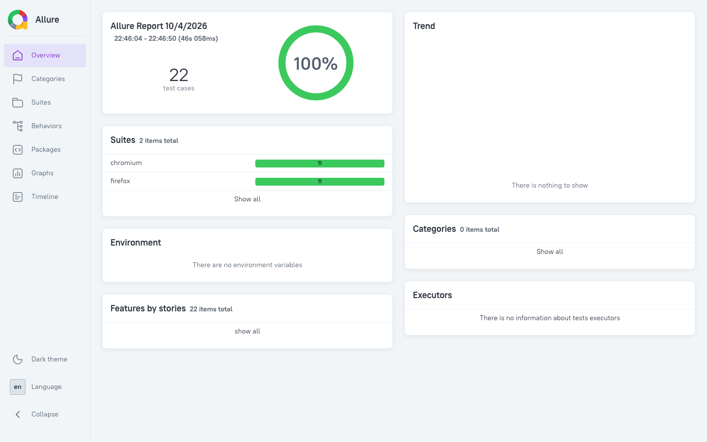
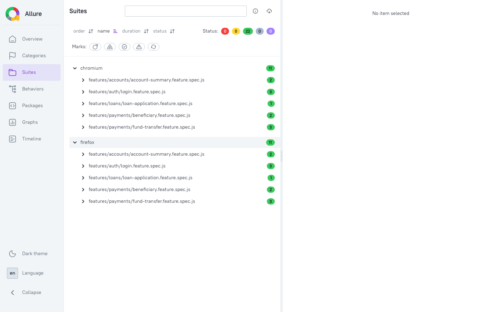
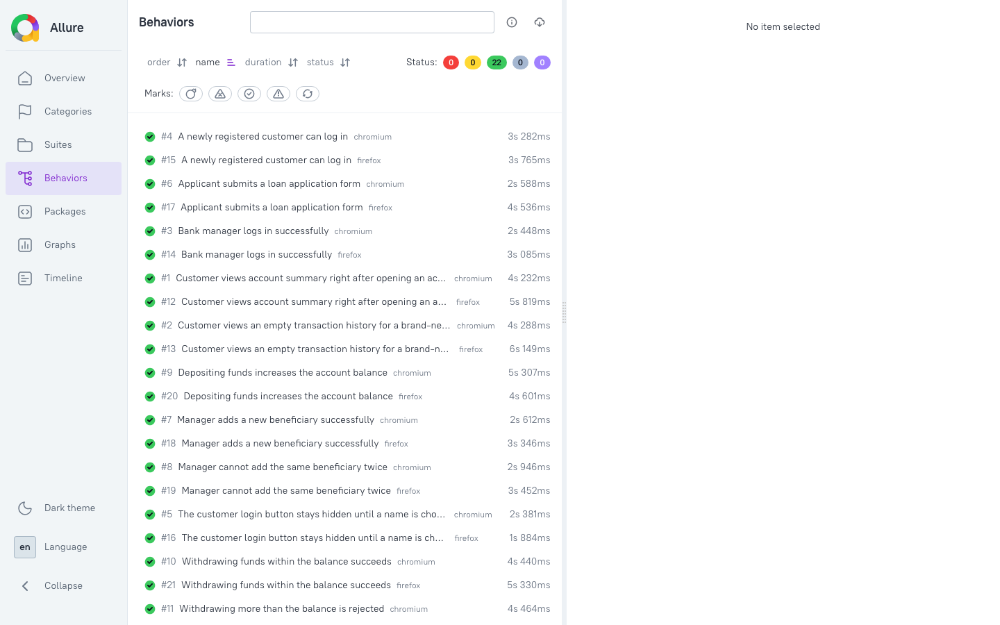
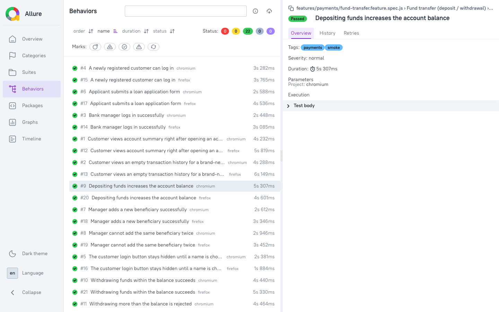

# Playwright BDD Framework

[](https://github.com/Jayshree94/playwright-bdd-framework/actions/workflows/playwright.yml)
[](LICENSE)

A BDD end-to-end test automation framework built with **Playwright**, **Cucumber** (Gherkin), and **TypeScript**, reporting through **Allure**, Playwright's HTML reporter, and JUnit XML.

Feature files describe behaviour in business-readable Gherkin; step definitions stay thin and delegate to Page Objects, keeping test intent separate from UI implementation detail.

## Table of contents

- [Tech stack](#tech-stack)
- [Target applications](#target-applications)
- [Prerequisites](#prerequisites)
- [Installation](#installation)
- [Environment configuration](#environment-configuration)
- [Running tests](#running-tests)
- [Reporting](#reporting)
  - [Report preview](#report-preview)
- [Project structure](#project-structure)
- [Writing a new scenario](#writing-a-new-scenario)
- [CI/CD](#cicd)
- [Known limitations](#known-limitations)
- [License](#license)

## Tech stack

| Layer | Tool |
|---|---|
| Test runner | [Playwright Test](https://playwright.dev/) |
| BDD / Gherkin | [playwright-bdd](https://vitalets.github.io/playwright-bdd/) + [@cucumber/cucumber](https://cucumber.io/docs/cucumber/) |
| Language | TypeScript |
| Reporting | Allure, Playwright HTML, JUnit XML |
| CI | GitHub Actions, Jenkins |

## Target applications

This suite runs against public demo applications (no credentials or internal access required):

| Domain | Target | Notes |
|---|---|---|
| Auth, Accounts, Payments | [XYZ Bank demo](https://www.globalsqa.com/angularJs-protractor/BankingProject/) | In-browser mock data; manager login creates customers/accounts, customer login does deposits/withdrawals. No real peer-to-peer transfer or payee module exists, so `fund-transfer` exercises deposit/withdrawal and `beneficiary` exercises manager "add customer" as the closest equivalents. |
| Loans | [DemoQA practice form](https://demoqa.com/automation-practice-form) | Placeholder only — see `features/loans/loan-application.feature` for why. Replace with a real target once one exists. |

## Prerequisites

- Node.js 18 or later (developed/tested on Node 24)
- npm (bundled with Node)
- Git

## Installation

```bash
git clone https://github.com/Jayshree94/playwright-bdd-framework.git
cd playwright-bdd-framework
npm install
npx playwright install chromium firefox
```

## Environment configuration

Copy `.env.example` to `.env` and adjust if needed:

```bash
cp .env.example .env
```

| Variable | Purpose | Default |
|---|---|---|
| `TEST_ENV` | Named environment key resolved in `config/environments.ts` (`qa`/`staging`/`prod`) | `qa` |
| `BASE_URL` | Overrides the resolved environment's base URL | XYZ Bank demo URL |
| `LOAN_FORM_URL` | Target for the placeholder loans feature | DemoQA practice form URL |
| `HEADLESS` | Informational flag for local runs; pass `--headed` to `playwright test` to see the browser | `true` |

`qa`, `staging` and `prod` all resolve to the same public URLs by default, since this suite targets single-instance public demo sites with no separate tiers — the three names exist to match a standard multi-environment config shape and are ready to be pointed at real tiers later.

## Running tests

```bash
npm test                  # bddgen + full suite (chromium + firefox)
npm run test:chromium     # chromium project only
npm run test:headed       # full suite, headed browser
npx playwright test --grep @smoke        # only @smoke-tagged scenarios
npx playwright test features/auth        # a single feature's generated spec
```

`npm test` always regenerates the Playwright specs from the `.feature` files first (`bdd:gen` → `bddgen`), so edits to Gherkin or step definitions are picked up automatically.

## Reporting

Every run produces three report formats under `reports/` (gitignored, regenerated per run):

```bash
npm run report:allure      # generate + open the Allure HTML report
npm run report:html        # open Playwright's own HTML report
cat reports/junit/results.xml   # JUnit XML, for CI test-result integrations
```

`posttest` regenerates the Allure report automatically after `npm test` finishes.

### Report preview

Screenshots below are from the Allure report (`npm run report:allure`), captured from a full `chromium` + `firefox` run of all 22 scenarios.

**Overview** — pass rate, per-browser suite breakdown, trend:



**Suites** — scenarios grouped by browser project and feature file:



**Behaviors** — every scenario by its Gherkin name, independent of file layout:



**Scenario detail** — tags, severity, duration and source for a single test:



## Project structure

```
.
├── playwright.config.ts        # defineBddConfig + projects/reporters
├── config/
│   └── environments.ts         # per-environment base URLs
├── features/                   # Gherkin specs, grouped by domain
│   ├── auth/login.feature
│   ├── accounts/account-summary.feature
│   ├── payments/fund-transfer.feature
│   ├── payments/beneficiary.feature
│   └── loans/loan-application.feature
├── src/
│   ├── steps/                  # step definitions (thin glue only)
│   ├── fixtures/               # test.extend() + createBdd(test)
│   ├── pages/                  # Page Objects, one per screen/flow
│   │   └── components/         # shared widgets (dialog handler, manager nav)
│   ├── data/builders/          # test data builders
│   ├── utils/                  # logger, etc.
│   └── types/
├── .features-gen/              # auto-generated by bddgen (gitignored)
├── reports/                    # Allure/HTML/JUnit output (gitignored)
├── ci/Jenkinsfile
└── .github/workflows/playwright.yml
```

## Writing a new scenario

1. Add or extend a `.feature` file under `features/<domain>/`.
2. Add any missing step definitions under `src/steps/<domain>.steps.ts`, calling into Page Object methods — steps should stay thin.
3. Add or extend the relevant Page Object under `src/pages/`. Register new fixtures in `src/fixtures/index.ts` if a new Page Object is introduced.
4. Run `npm run test:chromium` to verify locally before committing.

## CI/CD

- **GitHub Actions** (`.github/workflows/playwright.yml`): runs on push/PR to `main`/`master`; installs browsers, generates BDD specs, runs the suite, and uploads the HTML and Allure reports as workflow artifacts.
- **Jenkins** (`ci/Jenkinsfile`): parameterized on `TEST_ENV`; publishes the Allure report via the Allure Jenkins plugin's `publishHTML`/`junit` steps and archives `reports/**`.

## Known limitations

- `tests/auth.setup.ts` / Playwright `storageState` is intentionally not used: the target app has no server-side session, so persisting its in-browser mock data across workers would let parallel tests corrupt each other's state instead of isolating it.
- The loans feature has no real target application and is a placeholder; replace it when a real one is available.

## License

MIT &copy; 2026 [Jayshree94](https://github.com/Jayshree94) &mdash; see [LICENSE](LICENSE) for the full text.
